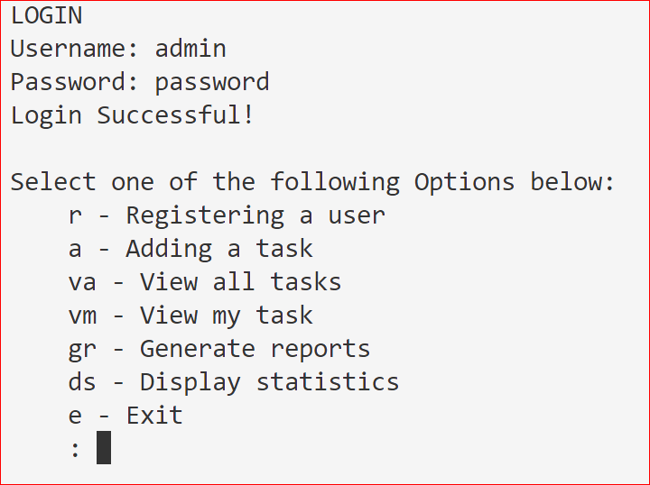
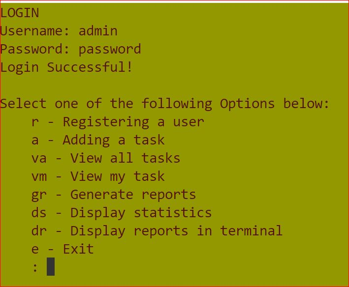
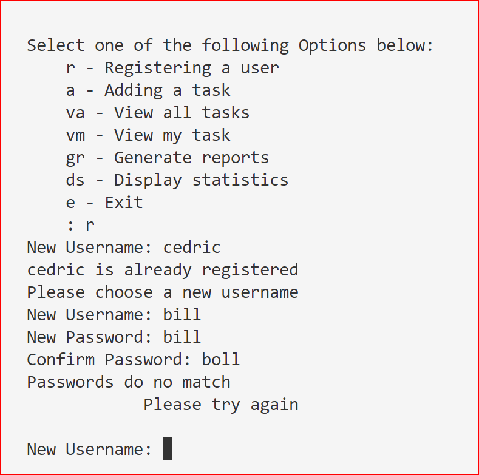
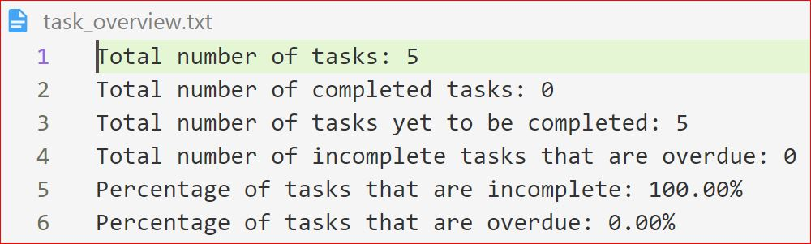
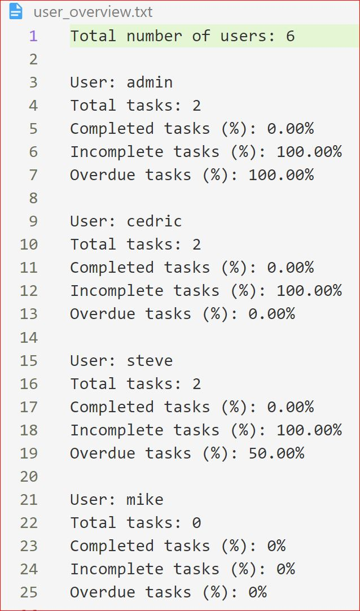

# finalCapstone
BYB 5
Task Manager
This is a Python file that monitors the status of tasks and allows the status to updated and new ones to be added. It is password protected and allows users to make and change certain records and allows admin only to make certain changes. It records certain reports to disk for later retreival.

# Contents
-[Installation](#installation)  
-[Objectives](#objectives)  
-[Using The File](#using-the-file)  
-[Methodology](#methodology)  
-[Functions](#functions) 
-[Checking Input Validity](#checking-input-validity)  
-[Reading And Writing To File](#reading-and-writing-to-file)  
-[File Operations](#file-operations)  
-[Text Reports](#text-reports)  
-[Conclusion](#conclusion)  

# Installation 
The file is available from <a href="https://github.com/CedricLittman/finalCapstone.git">Github</a>. Download the Python file and, provided there is a current copy of Python on the computer, it will run without any further additions.

To improve the look of the output in the terminal window ANSI codes are imported. For this to be possible the file ansi.py must be installed in the same directory. The file is available in the same Github repo as the task manager file.

# Objectives 
The task manager file was a HyperionDev bootcamp exercise and the objective was to refactor a file to make it DRYer, in other words reduce code repetition, and increase and improve its functionality. The file is written in Pytgon and, although it does include some imports, they do not require any pip installations.

# Using The File 
Once installed and running the user will be greeted with a login screen asking for a username and password. If the file has not been used before these are admin and password respectively. Once the user has succesfully logged in they will be greeted with a set of choices, as follows if the ansi.py file is not included:

This is a task manager file and it gives the operator the ebility to maintain records of the following:

r - Register a user  
a - Add a task  
va - View all tasks
vm - View my task  
gr - Generate reports  
ds - Display statistics  
e - exit  

If the ansi.py file is in the same directory the menu will look like this:

By choosing different options in the ansi.py file the colours can easily be changed. No tests were made for colour blindness at this point but, if this file were to be distributed more wisely it would be checked for ease of viewing by those affected by colour blindness and adjusted to make the output easy to view.

When one selects Register a user one is invited to enter a user name. If the username is already registered task manager tells the the user and prompts for another user name. Once the username has been entered the user is prompted to enter a password. One is required to enter the password twice to ensure it has been input correctly and if they are not the same the user is prompted for a new user name again.
Throughout the programme all inputs are converted to lower case to reduce errors from user input and also checked for validity. If any invalid inputs are received the function calls itself recursively and the user starts again.
The other inputs follow the same pattern and allow the records of the functions to be viewed, analysed and amended.

The file has text inputs and outputs and is used via the terminal window, in the developer's case in VS Code. Although the text presentation could have been improved with ANSI codes this was not done only because time did not allow. A typical input and output screen is shown below.

# Methodology
We were given a Python file which did not contain any functions making the code harder to follow and that did not effect all of the options contained in the menu. We were required to use functions to divide the various jobs the task manager effected and to reduce code repetition. We were also required to complete the code so it was able to fully effect all the options offered in the menu. The original file we were given is also available <a href="https://github.com/CedricLittman/finalCapstone/blob/main/original_task_manager%20(1).py">from this Github link</a>.

# Functions
The code was divided into functions using the following methodology.
After the user has successfully logged in initially a menu function is called which presents the user with the various jobs the programme can do. Choosing any of the options, except for ds, will itself call a function. As the function should only complete one task it would call further functions if it required information to be processed further. Some of the functions may contain some repetition of code such as reading and writing to the text files and, if this is the case, these jobs will be allocated to further functions, but time did not permit. This is definitely a modification that will be explored in future development of the file.

Some of the functions generated their own menus and two different methodologies were used to do this. One was a while true loop. The user input was checked fr validity and the user was kept being prompted for a valid input until one was received. Once a valid input was received it was passed to the conditional logic which called the appropriate function to complete the task.

The other methodology was to test the input for validity and, if the input was invalid, the function called itself recursively. Although recursive functions are not always well regarded no problems are anticipated with this use as the user is unlikely to make an invalid entry more than two or three times so the risk of a stack overflow is vanishingly small.

# Checking Input Validity
Valid inputs were restricted to simple to check ones such as a letter or two or a digit as these are very easy to check using conditional statements. In another project the programmer decided to check the validity of more complicated inputs using regular expressions but such a level of complication was not thought to be necessary for this project where simple inputs did not require any reduction in functionality.

# Reading And Writing To File
The programme read from and wrote to four different text files. One text, user.txt, file consisted on user names and passwords which was checked when the user logged in. When a new user was added thir details were added to the file.
The next, tasks.txt, contained the following information for each task:

- The user the task is assigned to
- The title of the task
- A description
- Due date for completion
- The date the task was assigned
- Whether or not the task has been completed
This file is read under various circumstances including the following. When the user wishes to see the tasks recorded by the programme and the information it contains about each one and when the user wishes to know various facts such as whether a task has been completed. It is read to control what the user can do. For example the user cannot change who the task was assigned to after it has been completed, presumably to prevent someone from taking the credit for the work of others. Before the user assigened to a task can be changed, therefore, the file is read to check if it has been completed. It is read to allow statistics to be calculated to be presented to the viewer.

The file is also written to when the user enters a new task and when details of a task are changed such as its description.

# File Operations
Once logged in the user can register a new user, as discussed, add a task and view all tasks. More functionality is included in the "vm" (View Mine) option which allows the user to view their  tasks.
The vm allows the user access to the following functionality:
- It displays all the user’s tasks in so they are easy to read. Each task is displayed with a corresponding number that is used to identify the task in later use.
- The user is able to select either a specific task (by entering the number mentioned above) or input ‘-1’ to return to the main menu.
- If the user selects a specific task, then they are able to choose to either mark the task as complete or edit the task.
- If the user chooses to mark a task as complete, the ‘Yes’/’No’ value that describes whether the task has been completed or is changed to ‘Yes’ in the tasks.txt file and if the user chooses to edit a task, the username of the person to whom the task is assigned or the due date of the task is changed in tasks.txt. The task can only be edited if it has not yet been completed.

# Text Reports
When the user chooses to generate reports, two text files, called task_overview.txt and user_overview.txt are generated. Both these text files output data so that it is easy to read.
task_overview.txt contains:
- The total number of tasks that have been generated and tracked using the task_manager.py.
- The total number of completed tasks.
- The total number of uncompleted tasks.
- The total number of tasks that haven’t been completed and that are overdue.
- The percentage of tasks that are incomplete.
- The percentage of tasks that are overdue.

Task_overview.txt will have the following format:

The text file user_overview.txt generated by the task manager programme when this report is requested contains:
- Currently logged in in user
- The total number of users registered with task_manager.py.
- The total number of tasks that have been generated and tracked using task_manager.py.
- The percentage of completed tasks.
- The percentage of incomplete tasks
- The percentage of tasks which are overdue

User_overview.txt will have the following format:

These text files are written so that they are in the same directory as the task manager file.

# Conclusion
The task manager file included in this directory effectively records and stores data pertinent to a list of tasks and, depending on the user allows this information to be edited. If the ansi.py file is also included the terminal out put is more appealing.
The file also enables statistical reports to be generated and these can both be displayed in the terminal and stored in a text file.

